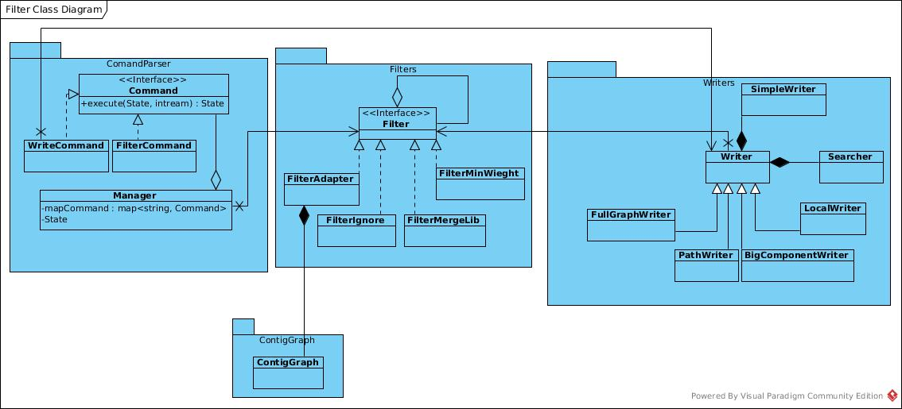

# Filter
Пакет отвечает за фильтрацию уже готового графа. 
## Архитектура
* данная часть приложения, когда уже есть 
готовый граф в формате .gr умеет разными 
способами фильтровать и 
выводить граф в dot формате. 
* Архитектурно разбивается на три крупных
модуля: 
    * CommandParser - отвечает за 
    распознование введеных команд и понимания
    в завсисимости от команды что надо делать. 
    * Filters - отвечает за фильтрацию графа. 
    * Writers - отвечает за вывод графа.

### CommandParser
* Имеется главный класс Manager.
    * Является точка входа. 
    * Считывает команды и взывает нужную команду в зависимости от 
считаного. 
    * В нем хранится State, который 
помнит некоторый контекст, что позволяет вводить 
дольнейшие команды более коротким путем. 
    * Хранится map<keyWord, Command> который 
    помогает по ключивому слову вводе понимать 
    какую команду надо вызвать и передавать 
    управление ей.
    * Хранится Filter - это отфильтрованный граф. 
* Семейство классов Command с одним методом 
 execute. Реализации интерфейса как раз и занимаются
 выплнением какой-то команды и вызываются из
 Manager
 
### Filters
* Слоистая структура, фильтры накладываются 
друг на друга. То есть внутри фильтра
хранится другой фильтр и фильтр работает на на
прямую с графом, а с другим фильтром. 
* При выполнение операции происходит цепная 
реакция. Filter смотрит на запрос, если может 
его обработать - выполняет, иначе передает 
на обработку внутрениму филтру, а потом 
как-то реагирует на изменение во внутриностях. 

### Writers
* умеют выводить Filters в разном 
виде в dot формте. 
* SimpleWriter занимается непосребственно 
выводом графа. 
* Searcher - отвечает за обход графа, 
например что бы выделить компоненту или окрестность. 
* реализации Writer более конкретно 
понимают что в данном случае нужно 
вывести используя внутри себя SimpleWriter и 
Searcher. 

